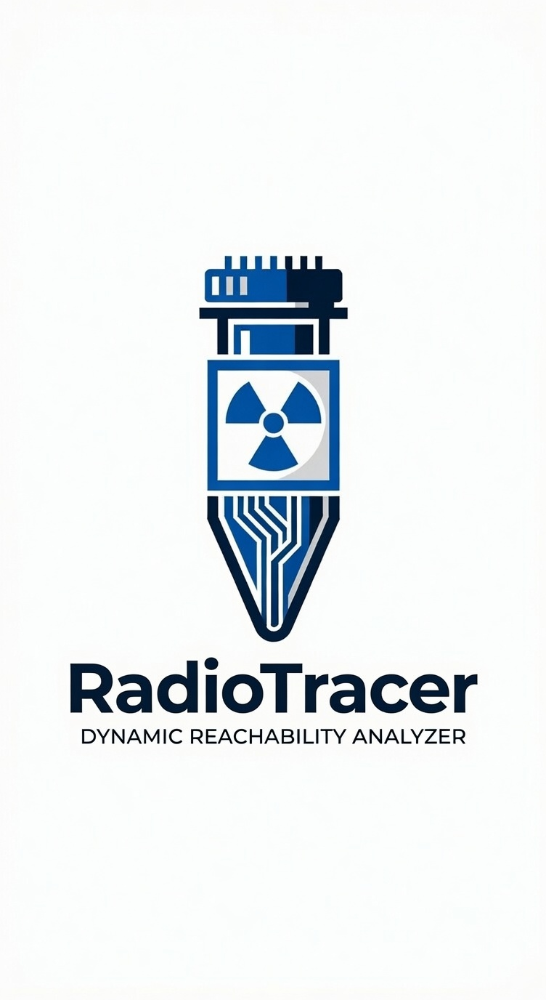

<p align="center">
  
</p>

<h1 align="center">RadioTracer</h1>
<p align="center">
  <b>Dynamic reachability for known dependency vulnerabilities · JVM agent (<code>radio-tracer-java</code>)</b>
</p>

<p align="center">
  <a href="LICENSE"></a>
  
  
  
  
</p>

<p align="center">
  
  
  
  
</p>

---

<details open>
<summary><b>Why the name RadioTracer</b></summary>
<br/>

In medicine and engineering, a **radiotracer** is a tiny probe you inject into a system so you can see where something actually goes — not where it *might* go on a map.

That’s the product:

| | |
|--|--|
| **Radio** | The “signal” — a known CVE / vulnerable method from your SCA watchlist |
| **Tracer** | The agent injects a lightweight probe and reports when that path lights up at **runtime** |

Package SCA is the inventory. Static graphs are the map. RadioTracer is the Geiger counter: **if the vulnerable method runs under your workload, you hear it.**

</details>

<details open>
<summary><b>Why this exists</b></summary>
<br/>

SCA tools (Dependabot, Snyk, Trivy, OWASP DC, …) answer *“is a vulnerable package on my tree?”*  
They do **not** answer *“did my app actually run the vulnerable code?”*

That gap is huge. Teams drown in alerts that never matter for their workload.

| Finding | ~Figure | Source |
|--------|---------|--------|
| OWASP DC–only sample that were **false positives** (enterprise Java) | **~88.8%** | Ponta et al., ESE 2020 [1] |
| Libraries **never used** at runtime | **~62%** | Contrast OSS materials, 2021 [2] |
| SCA noise tied to unreachable code (call graphs prune a large share) | **~92%** noise; **~61.9%** pruned | KAUST study, 2025 [4] |

Static reachability helps triage, but it’s still a graph guess (reflection, DI, frameworks hurt). RadioTracer answers with **runtime evidence**.

</details>

<details>
<summary><b>What people do today</b></summary>
<br/>

| Approach | Gap |
|----------|-----|
| Package SCA | No usage signal; lots of noise |
| Static reachability | Misses dynamic paths; can over-claim “reachable” |
| Commercial reachability | Closed function DBs; still mostly static |
| “Just upgrade” | Breakage without proof of real risk |

</details>

<details open>
<summary><b>What RadioTracer does</b></summary>
<br/>

**Prove a watched vulnerable method ran** under your tests / app.

```text
SCA → methods.json   [radio-tracer-cve-import, optional]
         ↓
java -javaagent:…=methods=watchlist.json,report=out.html
         ↓
your app / integration tests
         ↓
stderr: [REACHABLE] on first hit  ·  HTML on JVM exit
```

- Java agent (no rewrite of dependency JARs on disk)
- Probe when watchlist classes **load**; report when methods **run**
- Hits show instantly on first call; HTML summary when the process exits

> **REACHABLE** = prioritize.  
> **No hit** = not observed under this run — not “safe.”

Does **not** replace SCA, prove exploitability, or invent CVE→method maps by itself. For SCA → watchlist generation, see [radio-tracer-cve-import](https://github.com/radio-tracer/radio-tracer-cve-import).

</details>

<details open>
<summary><b>Support & requirements</b></summary>
<br/>

| | Supported today |
|--|-----------------|
| **Runtime (app JVM)** | **JDK 21+** (agent JAR is compiled with `--release 21`) |
| **Build** | JDK **21+** (CI uses **25**; building on 25 with release 21 is fine) |
| **Not supported** | Attaching the agent to **JDK ≤ 20** (class-file mismatch) |
| **Build tool** | Maven 3.9+ |
| **Coverage gate** | **100%** line + branch (JaCoCo) on the agent module |
| **Platform** | JVM / Java agent (`-javaagent`) only — no Node/Python runtime agent yet |

**Agent capabilities**

| Feature | Support |
|---------|---------|
| Instrument methods by `className` + `methodName` | Yes |
| Optional JVM method `descriptor` | Yes (narrows overloads) |
| First-hit `[REACHABLE]` on stderr + stack | Yes |
| Severity / CVSS in logs + HTML/console report | Yes (from watchlist) |
| Multi-module / multi-JVM HTML (flat merge) | Yes (sum hits for same CVE+method) |
| Force-push / rewrite of dependency JARs | No — pure runtime weave |

**Watchlist / SCA prep**

| | |
|--|--|
| Hand-written `methods.json` | Yes |
| Generated via Snyk → [radio-tracer-cve-import](https://github.com/radio-tracer/radio-tracer-cve-import) | Yes (companion tool) |
| Built-in Dependabot / OSV inside this repo | No (importer side) |

**Rule of thumb:** agent bytecode version ≤ app JVM version. Target **21** so the agent attaches cleanly to modern Spring/Gradle apps on 21+.

</details>

<details open>
<summary><b>Quick start</b></summary>
<br/>

**Needs:** JDK **21+** (to run the agent and demos), Maven 3.9+

```bash
mvn -q test package

# Browser UI (video demos): open http://localhost:8080 and click "Generate report"
java -javaagent:agent/target/radio-tracer-agent-0.1.0.jar=\
methods=examples/methods.json,report=/tmp/radio-tracer-report.html \
  -cp "demo-app/target/demo-app-0.1.0.jar:demo-app/target/deps/*" \
  com.example.app.DemoApp

# Headless (CI): same paths, exit after hits
java -javaagent:… -cp … com.example.app.DemoApp --cli
```

| Arg | Meaning |
|-----|---------|
| `methods=` | Watchlist JSON (**required**) |
| `report=` | HTML path (optional; written on JVM exit). Multi-JVM: fragments in `report.html.d/`, **flat-merged** HTML |
| `label=` / `runId=` / `module=` | JVM id for fragments (optional; else Maven `basedir` / `user.dir` / pid) |
| `slack=` / `webhook=` | Slack Incoming Webhook URL — notify on **first REACHABLE** + end-of-run summary (optional) |
| `verbose=true` | Log which classes get instrumented |

**Slack:** create an Incoming Webhook in your workspace, then pass it to the agent (or set env `RADIO_TRACER_SLACK_WEBHOOK`):

```bash
export SLACK_WH="https://hooks.slack.com/services/…/…/…"
java -javaagent:agent.jar=methods=examples/methods.json,report=/tmp/rt.html,slack=$SLACK_WH \
  -cp "demo-app/target/demo-app-0.1.0.jar:demo-app/target/deps/*" \
  com.example.app.DemoApp
# open http://localhost:8080 → Generate report → Slack + terminal [REACHABLE]
```

**Demo UI:** default `DemoApp` serves a small Acme Finance console. **Generate report** calls `OrderService.importOrder` → watched `DeserUtil#deserialize` (critical). Watch the terminal for `[REACHABLE]`.

**Multi-module Maven (Surefire):** attach the agent via `argLine` (not only `JAVA_TOOL_OPTIONS` on the parent) and point every module at the **same** `report=` path. Each fork appends a fragment; the final HTML is one table (hit counts summed for the same CVE+method):

```text
-javaagent:agent.jar=methods=methods.json,report=${maven.multiModuleProjectDirectory}/rt-report.html,label=${project.artifactId}
```

Samples: [`examples/methods.json`](examples/methods.json) · [`examples/sample-report.html`](examples/sample-report.html)

</details>

<details>
<summary><b>Watchlist format</b></summary>
<br/>

```json
{
  "version": 1,
  "methods": [
    {
      "cve": "CVE-…",
      "package": "group:artifact",
      "installedVersion": "1.0.0",
      "upgradeTo": "1.2.0",
      "severity": "critical",
      "cvssScore": 9.8,
      "cvssVector": "CVSS:3.1/AV:N/AC:L/PR:N/UI:N/S:U/C:H/I:H/A:H",
      "className": "com.example.Lib",
      "methodName": "vulnerableApi",
      "descriptor": "(Ljava/lang/String;)V",
      "confidence": "high",
      "source": "snyk"
    }
  ]
}
```

| Field | Notes |
|-------|--------|
| `methodName` | Method name to instrument |
| `descriptor` | Optional JVM descriptor; omit to match all overloads |
| `severity` / `cvssScore` / `cvssVector` | SCA risk (shown in `[REACHABLE]` logs + HTML/console report); optional |
| `confidence` | Mapping quality (high/medium/low), **not** CVSS — optional for the agent |

</details>

<details>
<summary><b>Repo layout</b></summary>
<br/>

```text
agent/      Java agent + tests (JaCoCo 100% line/branch)
demo-lib/   Fake vulnerable dependency
demo-app/   App that calls the dep
examples/   Watchlist + sample HTML report
docs/       Logo, branch protection notes
```

</details>

<details>
<summary><b>Roadmap</b></summary>
<br/>

- [x] JVM agent + HTML report  
- [x] Java **21+** attach target  
- [x] SCA → methods.json prep ([radio-tracer-cve-import](https://github.com/radio-tracer/radio-tracer-cve-import))  
- [ ] Optional Java 17 bytecode profile for older fleets  
- [ ] Other runtimes under the RadioTracer umbrella  

</details>

<details>
<summary><b>References</b></summary>
<br/>

1. Ponta, Plate, Sabetta — *Empir. Softw. Eng.* 2020 — https://doi.org/10.1007/s10664-020-09830-x  
2. Contrast Security OSS materials (2021) — unused library rates  
3. Semgrep SCA reachability notes — https://semgrep.dev/blog/2024/sca-reachability-analysis-methods  
4. KAUST empirical study (2025) on unreachable SCA noise  
5. Plate, Ponta, Sabetta — IEEE QRS 2015 — usage-based OSS vulnerability assessment  

</details>

---

**License:** [Apache-2.0](LICENSE) · use and commercialize under the usual Apache terms.
